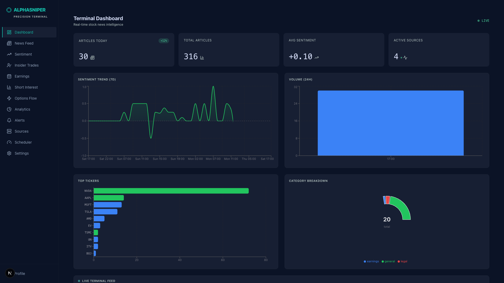
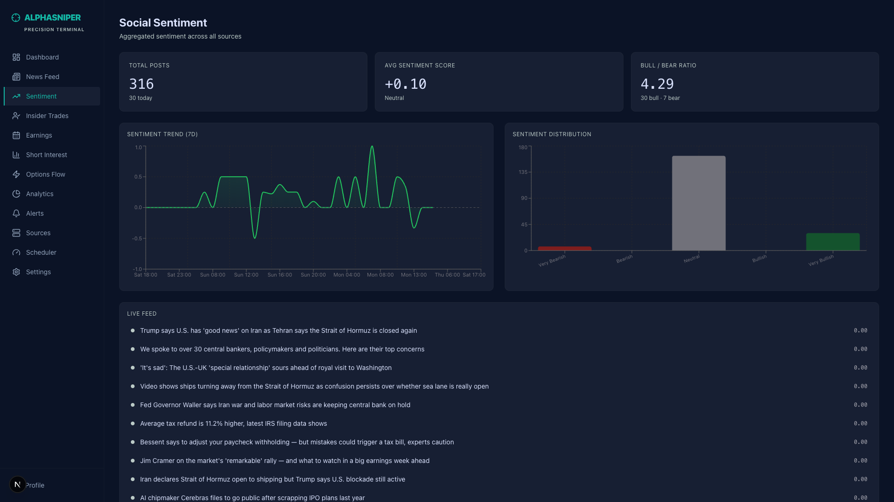
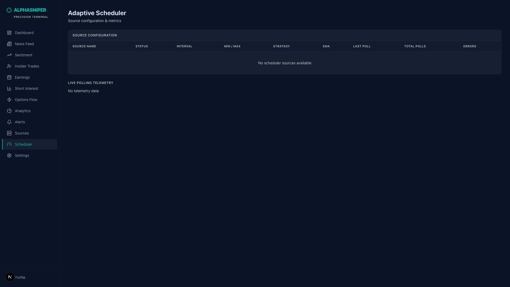

# UI Audit — Stitch Design vs Live Webapp

- Audit date: 2026-04-18
- Audited URL: `http://localhost:8210`
- Design refs: `plans/260418-1446-platform-expansion/stitch-designs/`
- Live screenshots: `plans/reports/ui-audit-screenshots/{dashboard,sentiment,scheduler}-live.png`
- Pages audited: Dashboard (`/`), Sentiment (`/sentiment`), Scheduler (`/admin/scheduler`)
- Global review: `src/webapp/app/layout.tsx`, `src/webapp/components/layout/sidebar.tsx`

---

## 0. Global layout & sidebar (affects every page)

Sidebar is the biggest deviation. Design has a **w-64 sidebar with a prominent teal `EXECUTE TRADE` CTA**, a **fixed top navbar** (News Analytics title + Markets/Screener/Alerts links + search + sync/wallet/Trade buttons), only 6 main items (Dashboard, News Feed, Sentiment, Portfolios, Markets, Settings), and Notifications/Profile at the bottom. Live app has **w-56 sidebar with 12 flat nav items, no CTA, no top navbar at all**, only Profile in footer. Design also shows each row at `py-3` with generous spacing; live uses tighter `py-2.5`.

| Area | Design | Current | Severity | Fix hint |
|---|---|---|---|---|
| Sidebar width | `w-64` (256px) | `w-56` (224px) | med | Bump `components/layout/sidebar.tsx` aside to `w-64`. |
| EXECUTE TRADE CTA | Large teal primary button at top of nav (below logo) with bolt icon, shadow `0 4px 14px rgba(20,184,166,0.39)` | Missing entirely | **high** | Add `<button>` block between logo and nav list; use `bg-[#14b8a6] text-[#003731]` + glow shadow. |
| Top navbar | Fixed `h-16` bar with page title, pipe divider, Markets/Screener/Alerts links, search (ticker mono), sync/wallet icons, Trade button | Missing entirely | **high** | Add a `<TopBar />` in `layout.tsx`; make `<main>` sit under it (`pt-16`). Put per-page title into TopBar, not page body. |
| Nav item count | 6 items (Dashboard, News Feed, Sentiment, Portfolios, Markets, Settings) | 12 items flat list | **high** | Either collapse into 6 groups matching design, or split into "Primary" (6) and a collapsible "Data" section (Insider, Earnings, Short, Options, Analytics, Alerts, Sources, Scheduler). See §5. |
| Nav items not in design | Insider Trades, Earnings, Short Interest, Options Flow, Analytics, Alerts, Sources, Scheduler | Present as top-level | med | Group under "Data" or "Feeds" submenu. |
| Nav items missing in live | Portfolios, Markets | Not implemented | med | Add stub routes or remove from design scope. Confirm with owner. |
| Footer items | Notifications + Profile | Profile only | med | Add `Notifications` link with bell icon above Profile. |
| Logo icon | `my_location` / `gps_fixed` Material crosshair | Lucide `Crosshair` (close enough) | low | Acceptable. |
| Active state | Teal text + left-border + `bg-[#171f33]` + `rounded-r-md` | Same treatment | low | Matches. |
| Font family | Inter body, JetBrains Mono for numerics | Inter + JetBrains Mono (ok) | low | OK. |
| Main padding | `p-8` with `mt-16` under top nav | `p-8` with no top nav offset | med | After adding TopBar, set `main` to `pt-16 p-8`. |

---

## 1. Dashboard (`/`)

Live page duplicates the sidebar/header logic in-page (has its own "Terminal Dashboard" H1 + LIVE pill) because there is no shared TopBar. KPI cards read 30 / 316 / +0.10 / 4 — real but sparse (looks like dev data). Biggest issues: missing TopBar, Volume chart is a single giant blue bar (Recharts not binned correctly), Category donut uses blue/red palette instead of teal/green design tokens, Live Terminal Feed table is rendered off-viewport (pushed below fold) with no ALL/CRYPTO/MACRO filter chips. Top Tickers + Category Breakdown do NOT exist in the design — design only has Sentiment Trend + Volume (2-up) then Live Terminal Feed.

| Area | Design | Current | Severity | Fix hint |
|---|---|---|---|---|
| Page header location | In TopBar (`News Analytics`) | In page body (`Terminal Dashboard` + LIVE pill) | **high** | Move into TopBar once added; drop in-page H1. |
| Chart grid | 2 charts only (Sentiment Trend, Volume 24H) | 4 charts (+ Top Tickers + Category) | med | Either remove Top Tickers/Category from dashboard (move to `/analytics`), or keep but match 2x2 grid styling. |
| KPI #1 trend pill | `+12%` hardcoded in design | `+12%` hardcoded in live (fake, not tied to data) | med | Either compute real delta via API or remove. Currently misleading. |
| KPI #3 Avg Sentiment | `+0.62` + green BULLISH chip + subtle gradient underline | `+0.10` neutral, no BULLISH chip | low | Add bullish/bearish chip bound to `sentimentLabel()`. |
| KPI #4 "Active Sources" | Number `482` + "Live" pulse dot | `4` sources | low | Real data — keep. Add "Live" label next to pulse. |
| Volume (24H) chart | Vertical bar histogram, 12-24 bars, teal tint with hover tooltips, tallest bar highlighted | Single giant filled area, `17:00` only x-label | **high** | `ArticlesPerHourChart` is binning wrong — all articles landing in one bucket. Fix the hourly bucketing in `/api/articles/by-hour` or client aggregation. Render as `<BarChart>` not area. |
| Sentiment Trend chart | Smooth teal line + transparent green gradient fill + BULL/BEAR pills in header | Jagged bright green line, no header pills, no gradient area | med | Add `<defs><linearGradient>` under the line for gradient fill; soften stroke to `#4edea3`; add BULL/BEAR legend pills. |
| Category Donut | N/A in design | Uses blue (`#3b82f6`) + red + green instead of teal `#4fdbc8` / secondary `#4edea3` / error `#ffb4ab` | med | If kept, swap palette to design tokens (teal/green/red/outline). |
| Top Tickers bar chart | N/A in design | Uses blue bars (`#3b82f6`) — clashes with teal brand | med | Recolor to `#4fdbc8` + `#4edea3`. |
| Live Terminal Feed header | Sticky header with `ALL / CRYPTO / MACRO` filter chips (teal outline on active) | Header only has title + pulse dot | med | Add filter button row on right side. |
| Feed row layout | 5-col grid: ticker+cap chip stacked / headline / sentiment dot+score / time HH:MM:SS | 6-col table: dot / ticker / cap / headline / sentiment / time | low | Current is close; consider stacking `ticker` over `MEGA/LARGE` cap chip like design (vertical). Also show full `HH:MM:SS` not `12m`. |
| Sentiment dot glow | `shadow-[0_0_8px_rgba(78,222,163,0.6)]` on bullish/bearish | Flat dot, no glow | low | Add inline shadow for bullish/bearish dots. |
| Row hover | Left green/red rail slides in on hover (`opacity-0 group-hover:opacity-100`) | Only bg tint | low | Add 1px colored left-rail. |
| Ticker color | `text-primary` (teal) | `text-[#4fdbc8]` teal | low | OK. |

---

## 2. Sentiment (`/sentiment`)

Layout shape is **completely different**. Design is a 2-column split: left = h1 + 2 summary cards (Reddit/StockTwits) + scrollable Live Feed with rich card rows. Right = 320px sidebar with Ticker Filter + **Aggregate Sentiment conic donut** (13.1k posts). Live app is a stacked single-column with 3 KPIs, 2 tiny charts (Trend + Distribution), tiny one-line feed rows, and a Top Movers list. No ticker filter, no donut, no Reddit/StockTwits breakdown cards.

| Area | Design | Current | Severity | Fix hint |
|---|---|---|---|---|
| Layout | 2-col (flex: main 1fr + sidebar 320px, gap-6) | Single column stack | **high** | Wrap content in `

...
<aside class="w-80">...</aside>
`. |
| Summary cards | Reddit (orange icon, 4.2k posts, +0.45 avg) + StockTwits (blue icon, 8.9k msgs, 68% bullish) | 3 generic KPIs (Total/Avg/Ratio) | **high** | Replace with 2-col source breakdown: one per dominant source (Finnhub/MarketAux since Reddit+StockTwits not ingested — see §data below). |
| Live Feed rows | Rich cards with source icon, subreddit/username, timestamp "14m ago", headline, sentiment chip (BULLISH/BEARISH/NEUTRAL), ticker pills `$NVDA`, upvote count; left-border color-coded | One-line rows: dot + headline + score, `<a>` opens URL | **high** | Redesign feed item to card with: icon + source + time; title (2-line clamp); sentiment chip + `$TICKER` chips. Keep left-border `border-l-[3px]` color-coded. |
| Aggregate Sentiment donut | 160px conic-gradient donut (green 55% / red 30% / gray 15%) with "13.1k posts" center + 3-row legend with % and count | Missing | **high** | Add right-sidebar card. Use SVG donut or conic-gradient div (like design HTML). |
| Ticker Filter panel | Right sidebar: search input with `$AAPL` placeholder + quick-pick chips `$NVDA $TSLA $AMD` | Missing | med | Add filter panel; wire to `?ticker=` query param. |
| Top Movers list | Not in design | Present | low | Design doesn't have this section — move to `/analytics` or keep if useful. |
| Page subtitle | "Reddit & StockTwits analysis" | "Aggregated sentiment across all sources" | low | Change subtitle to actual ingested sources. |
| Mock-vs-real data | Design shows r/wallstreetbets + StockTwits usernames | Live shows real news headlines (Finnhub/MarketAux) | **high** (expectation mismatch) | Design implies Reddit/StockTwits ingestion not yet in pipeline. Either add those collectors, or retitle page "News Sentiment" + relabel cards. Confirm scope. |
| Charts (Trend + Distribution) | Not in design | Present, small | low | Design omits these — either remove or shrink into sidebar. |

---

## 3. Scheduler (`/admin/scheduler`)

Design is a polished data table with 4 sources (SEC Filings, Twitter API, Reddit Scraper, Bloomberg Terminal RSS) showing Status pill, Current Interval, Min/Max Bounds, Strategy (AUTO/MANUAL), EMA, Last Poll, Total Polls, Errors — plus a 3-card **Live Polling Telemetry** row below with mini bar sparklines. Live page shows only "No scheduler sources available" + "No telemetry data" — empty state only.

| Area | Design | Current | Severity | Fix hint |
|---|---|---|---|---|
| Source rows | 4 configured sources with rich data | Empty table | **high** (data pipeline) | Backend: ensure `/api/admin/scheduler/sources` returns configured sources. Table structure is already ~right. |
| Status pill | Colored chip: green "Active", yellow "Paused", etc. | N/A (no rows) | med | When rows render, use `bg-secondary/10 text-secondary` chip. |
| Strategy pill | Teal "AUTO" / gray "MANUAL" chip inside cell | N/A | med | Render as small bordered pill. |
| Telemetry cards | 3-up grid of mini latency sparkline cards (42 req/s, 1,204 req/s, SOURCE OFFLINE) | Plain "No telemetry data" text | **high** | Build telemetry card component with mini bar chart (like design's 12 stacked bars). |
| Header location | "Adaptive Scheduler" title under TopBar | In-page H1 | med | Same TopBar issue as dashboard. |
| Active nav item | "Settings" highlighted in design (scheduler shown as sub-page of Settings) | "Scheduler" as own nav item (top-level) | low | Fine either way — but this confirms design treats Scheduler as a Settings sub-page, not a top-level nav entry. Consider nesting under Settings. |

---

## 4. Menu structure gap (design vs routes)

Design sidebar = 6 items + 2 footer + CTA. Live sidebar = 12 items + 1 footer, no CTA.

| Design item | Has route? | Route path |
|---|---|---|
| Dashboard | yes | `/` |
| News Feed | yes | `/feed` |
| Sentiment | yes | `/sentiment` |
| Portfolios | **no** | not implemented |
| Markets | **no** | not implemented |
| Settings | yes | `/settings` |
| Notifications (footer) | partial | `/alerts` exists but no Notifications link |
| Profile (footer) | no route | `href="#"` placeholder |
| EXECUTE TRADE (CTA) | n/a | no route |

Live-only routes not in design: `/earnings`, `/insider-trades`, `/options-flow`, `/short-interest`, `/ticker/[symbol]`, `/admin/scheduler`, `/analytics`, `/alerts`, `/sources`.

**Recommendation:** adopt a **2-tier sidebar**: top 6 match design (Dashboard, News Feed, Sentiment, Portfolios, Markets, Settings) where Portfolios can link to `/analytics` and Markets can be a dashboard of `/earnings` + `/short-interest` + `/options-flow` + `/insider-trades`. Keep scheduler/sources/admin behind Settings. Alerts -> Notifications footer.

---

## 5. Prioritized punch list (top 10 by visual impact)

1. **Add fixed TopBar** (`h-16`, title slot, Markets/Screener/Alerts links, ticker search, sync/wallet/Trade buttons) and wire into `layout.tsx`. Move per-page H1s into it. (global)
2. **Add `EXECUTE TRADE` CTA in sidebar** above nav list — teal button with bolt icon + glow shadow. (global)
3. **Collapse sidebar to 6 primary items + group rest** under a Data/Admin section; bump width to `w-64`; add Notifications + Profile in footer. (global)
4. **Fix Volume (24H) chart** — currently a single huge bar, bucketing is broken. Should render 12-24 hourly bars in teal. (dashboard)
5. **Rebuild `/sentiment` as 2-column layout** with source-breakdown cards on left, rich feed cards, and right-sidebar Aggregate Sentiment donut + Ticker Filter. (sentiment)
6. **Reskin Sentiment feed rows** from one-line links to card rows with source icon, subreddit/user label, timestamp, sentiment chip, ticker pills. (sentiment)
7. **Add Aggregate Sentiment donut** (conic-gradient or SVG) with center count + 3-row legend. (sentiment)
8. **Re-palette Dashboard auxiliary charts** (Top Tickers, Category Donut) from blue/red to teal `#4fdbc8` + secondary `#4edea3` + error `#ffb4ab`. (dashboard)
9. **Fix Scheduler empty state** — backend `/api/admin/scheduler/sources` returning no data; table scaffold is right but missing rows + telemetry mini-sparklines. (scheduler)
10. **Add filter chips to Live Terminal Feed** (ALL/CRYPTO/MACRO) + sticky header + sentiment-dot glow + ticker+cap vertical stack in row. (dashboard)

---

## Unresolved questions

1. Are Reddit + StockTwits collectors planned? Sentiment design assumes those sources; current pipeline only has Finnhub/MarketAux/SEC EDGAR + the new Tier-2 sources. Clarify whether to retitle page or implement new collectors.
2. `Portfolios` and `Markets` nav items in design — are these future features or should they be dropped from the sidebar spec?
3. Should `/analytics`, `/alerts`, `/sources`, `/admin/scheduler` remain top-level or be nested (e.g. under Settings or a Data group)?
4. The dashboard "Top Tickers" and "Category Breakdown" charts don't exist in the Stitch design — keep them (then restyle) or move off the dashboard?
5. KPI pills like `+12%` on Articles Today are hardcoded — should I wire them to real period-over-period deltas or remove?
